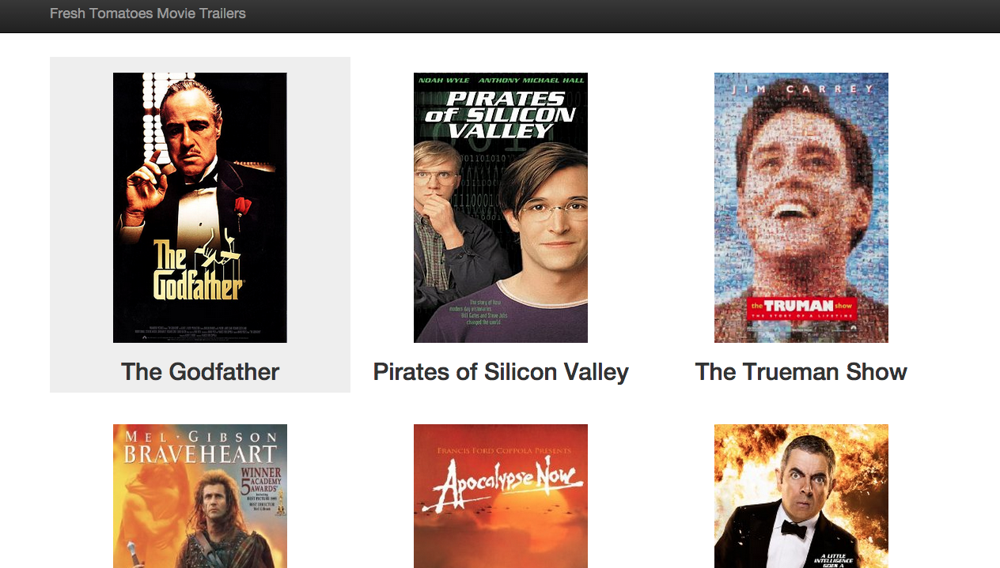
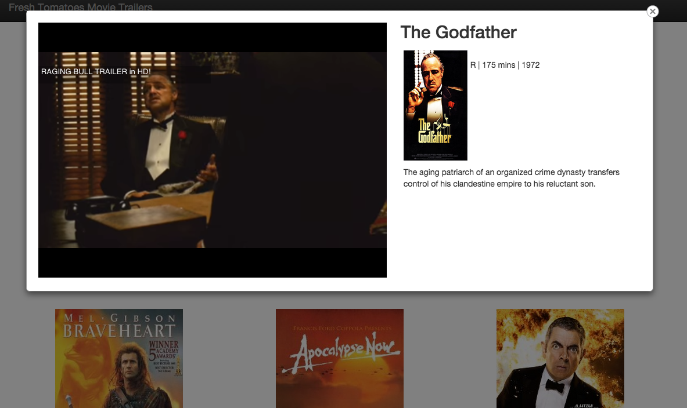

# movie-trailer-website
A movie trailer website written in python that would show general information about the movie and play its trailer.

### Requirements
 - Python 2.7

### Setting up project
To configure the project simple clone the repo using
```
 git clone https://github.com/talib570/movie-trailer-website.git
```
cd into the folder `movie-trailer-website` 
```
  cd movie-trailer-website
```
then type the following command
```
  python entertainment_center.py
```

### CHANGELOG
For changelogs please see the file called CHANGELOG.

### Example screenshots
Main page:


Movie trailer:

### License
 - Please see the file called LICENSE.